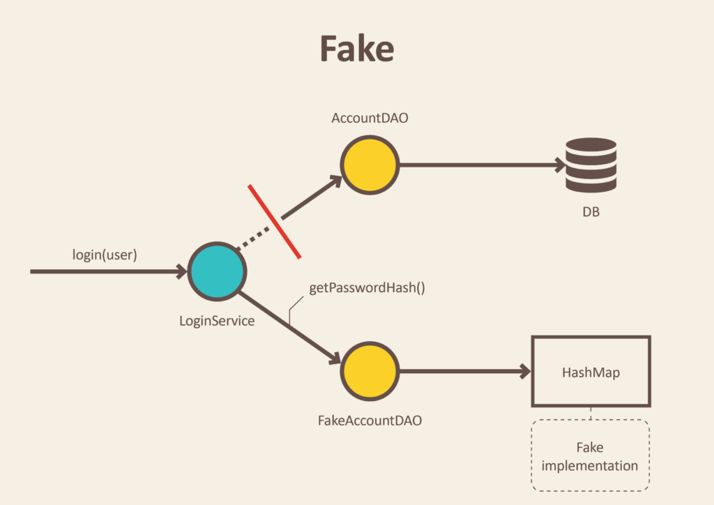

# Test Doubles

A test double is a generic term to refer to any object that stands in for a production one during testing.

More materials:

- https://khalilstemmler.com/wiki/test-doubles/
- https://ecom.software/why-you-should-use-fakes-instead-of-mocks/


# Stubs

Helper objects that return predefined values to help us do our tests.They are mostly used for payload for a function.


Example: instead of getting grades (2, 3, 4, 5, 6) from a database we can stub them and use them in our tests.

```
enum grades = {
  EXCELLENT="A",
  GOOD="B",
  SATISFACTORY="C",
  PASSING="D",
  NOT_PASSING="F"
};
```

# Fakes

Fakes are objects that have working implementation of a functionality or external service we use.



# Mocks (like Fakes but with some extra functionality provided by Jest)

Fakes are objects that have working implementation of a functionality or external service we use.We can also perform some extra assertions against those mocked functions like: how many times the mocked function is called, with what arguments, etc...

- jest.fn(function) // used to create a mocked function/object

Example:

```
const getNumber = jest.fn((x: number) => x + 42);
expect(getNumber.mock.calls).toHaveLength(1); // check if the mocked function is called for the first time
expect(getNumber).toBeCalledTimes(1); // works the same as mock.calls

expect(getNumber.mock.lastCall); // returns the arguments for the last mock call

```

# Spies

Spies work pretty much the same as mocks.The only difference is that spies create half mock objects and also track method calls.

- jest.spyOn(class/object, method); // spy on a method within a class

We could also overwrite the origin function and create our own implementation:

- jest.spyOn(object, method).mockImplementation(() => {}); // create custom implementation

We can also spy on modules:

- jest.spyOn(console, "log"); // spy on the console.log method
