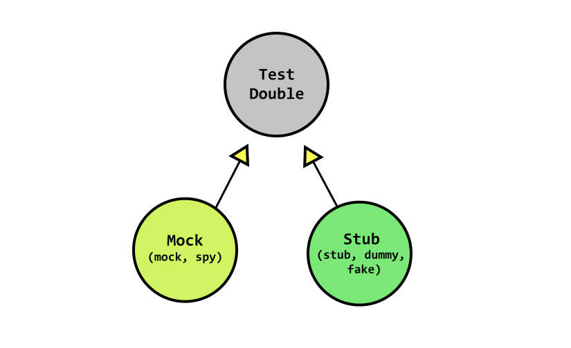
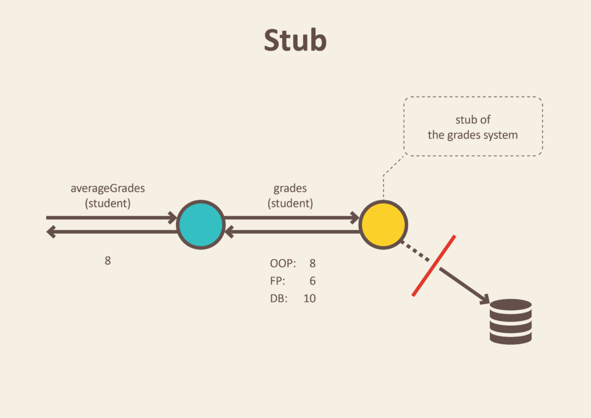

# Test Doubles

A test double is a generic term to refer to any object that stands in for a production one during testing.

- materials
  https://khalilstemmler.com/wiki/test-doubles/



# Stubs

Helper objects to help us do our tests.They are mostly used for payload for a function.



Example: instead of getting grades (2, 3, 4, 5, 6) from a database we can stub them and use them in our tests.

```
enum grades = {
  EXCELLENT="A",
  GOOD="B",
  SATISFACTORY="C",
  PASSING="D",
  NOT_PASSING="F"
};
```

# Fakes

# Mocks

# Spies
